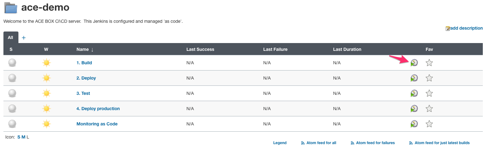
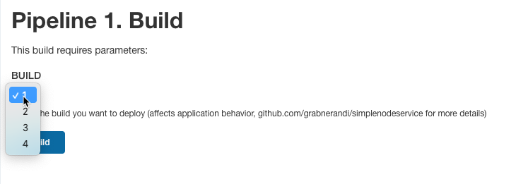
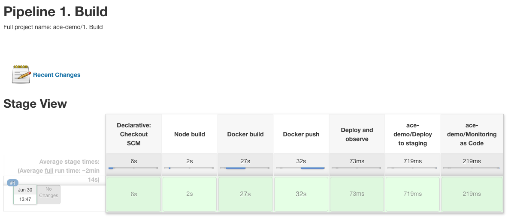

# 1. Build
As a first step we are going to build our simplenodeservice application. This is a very simple pipeline that is the only one that needs to be manually triggered.

## Triggering the pipeline
In order to trigger the pipeline, click on the _Play_ icon next to `1. Build`


You will be promted by a drop down with 4 options:



- `1` will build a fast version with no issues that will pass the quality gates
- `2` will build a slow version that will fail the quality gate
- `3` will build a fast version with no issues that will pass the quality gates
- `4` will deploy a version with issues in production

Select `1` and click on __Build__

The build will now launch and can take a little bit of time the first time to get started. This is because the pod that will execute the pipeline needs to be downloaded and launched. Subsequent builds (of any version) will be a lot faster.

The build has the following stages. You can open the coresponding Jenkinsfile in gitea as well (jenkins/build.Jenkinsfile)



1. `Node` build will build the nodejs app
    ```
    stage('Node build') {
        steps {
            checkout scm
            container('nodejs') {
                sh 'npm install'
            }
        }
    } 
    ```

2. `Docker build` will build and tag the docker image
    ```
    stage('Docker build') {
        steps {
            container('docker') {
                sh "docker build --build-arg BUILD_NUMBER=${env.BUILD} -t ${env.TAG} ."
            }
        }
    }
    ```

3. `Docker push` will push the built image to the local docker registry
    ```
    stage('Docker push') {
        steps {
            container('docker') {
                sh "docker push ${env.TAG}"
            }
        }
    }
    ```

4. `Deploy and observe` will launch two pipelines in parallel: `2. Deploy` and `Monitoring as code`
    ```
    stage('Deploy and observe') {
        parallel {
            stage('ace-demo/Deploy to staging'){
                steps {
                    script { env.V_TAG = sh(returnStdout: true, script: "echo ${env.GIT_COMMIT} | cut -c1-6 | tr -d '\n'") }
                    build job: "2. Deploy",
                    wait: false,
                    parameters: [
                        string(name: 'APP_NAME', value: "${env.APP_NAME}"),
                        string(name: 'TAG_STAGING', value: "${env.TAG}"),
                        string(name: 'BUILD', value: "${env.BUILD}"),
                        string(name: 'ART_VERSION', value: "${env.BUILD}.0.0-${env.V_TAG}")
                    ]
                }
            }
            stage('ace-demo/Monitoring as Code') {
                steps {
                    build job: "Monitoring as Code",
                    wait: false
                }
            }
        }
    }
    ```

    Check out [2. Deploy](2_DeployStaging.md) and [Monitoring as Code](MonitoringAsCode.md) files for more details about these stages.