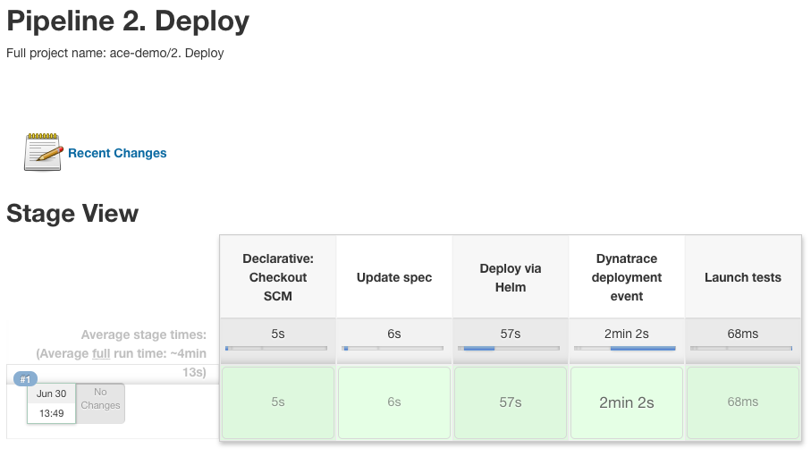
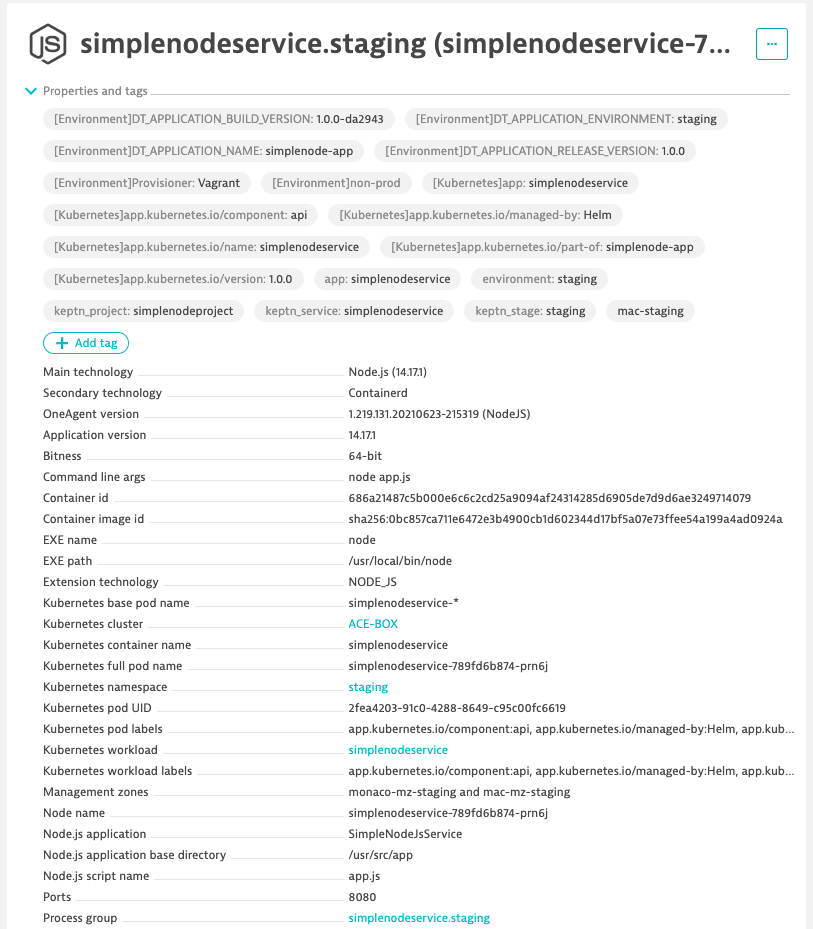
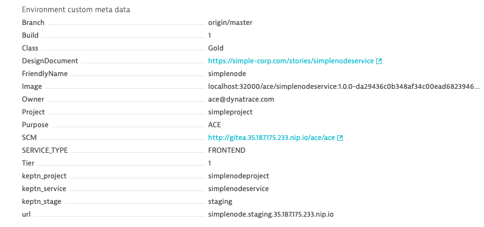
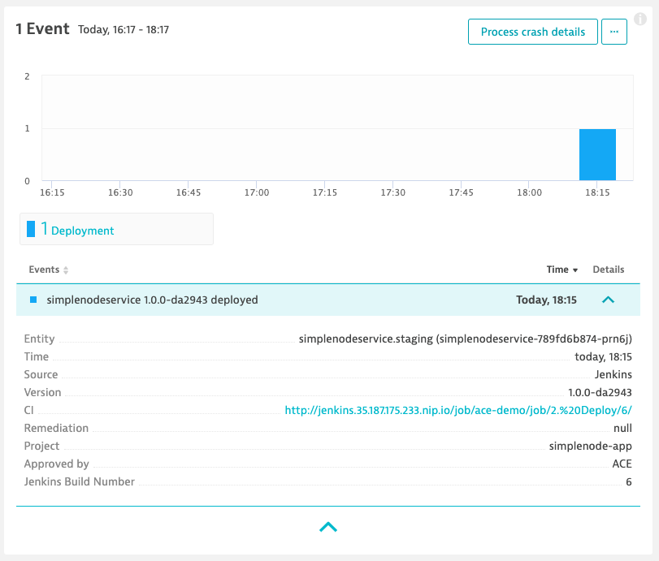
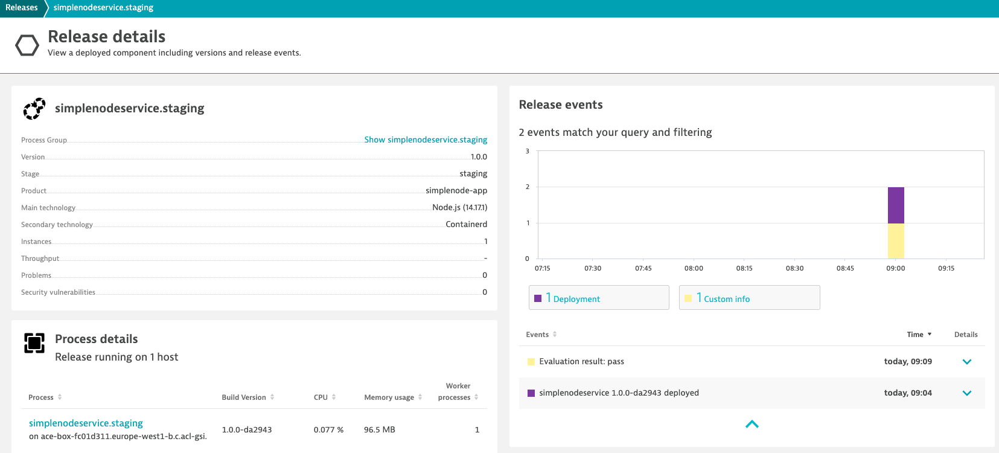

# 2. Deploy
This pipeline will deploy simplenodeservice in staging, set metadata in Dynatrace and send a Deployment Event as well



Check out the pipeline (jenkins/deployStaging.Jenkinsfile) for more details.

## Update Spec
This stage will generate meta data that will be later used to automatically show up as properties and tags within Dynatrace. Both static metadata will be read, from a file called `manifests/staging/dt_meta.yaml` (see below), and dynamic metadata will be generated as well.

```yaml
---
metadata:
  - key: "Owner"
    value: "ace@dynatrace.com"
  - key: "FriendlyName"
    value: "simplenode"
  - key: "SERVICE_TYPE"
    value: "FRONTEND"
  - key: "Project"
    value: "simpleproject"
  - key: "DesignDocument"
    value: "https://simple-corp.com/stories/simplenodeservice"
  - key: "Tier"
    value: "1"
  - key: "Class"
    value: "Gold"
  - key: "Purpose"
    value: "ACE"
tags:
  - key: "non-prod"
  - key: "Provisioner"
    value: "Vagrant"
```

From within this file, everything under `metadata` will be added as a custom property and everything under `tags` will be added as a tag in Dynatrace. A method in the Jenkins pipeline will transform the yaml to the right environment variables. Lateron the string variable will be set using the helm chart.

## Deploy via helm
During this phase, simplenodeservice will be deployed using a helm chart.
The Helm chart (located in the helm/simplenodeservice folder in the repo) supports `DT_CUSTOM_PROP` and `DT_TAGS` environment variables (see above) as well as the environment variables required for the Release Inventory: `DT_RELEASE_VERSION`, `DT_RELEASE_BUILD_VERSION`, `DT_RELEASE_PRODUCT` and `DT_RELEASE_STAGE`. Alternatively, the Kubernetes labels used for the Release Inventory could be used, but they do not apply version-tracking on PurePath level (see later).

A simplenodeservice will be deployed with the version and custom metadata/tags attached.





An event is also sent and can be observed:



Last but not least, the Release Inventory is also populated with the SimpleNodeService



This is all driven through the helm chart that populates those fields.
Check out the full file at `helm/simplenodeservice/templates/deployment.yaml` in the ace/ace repo.

```yaml
spec:
  containers:
  - name: {{ .Chart.Name }}
    image: {{ .Values.image }}
    env:
    - name: DT_TAGS # sets the Tags in Dynatrace
      value: {{ .Values.dt_tags }}
    - name: DT_CUSTOM_PROP # sets the Properties in Dynatrace
      value: {{ .Values.dt_custom_prop }}
    - name: DT_RELEASE_VERSION # sets the Release Version in Dynatrace
      value: "{{ .Values.version }}"
    - name: DT_RELEASE_BUILD_VERSION # sets the Release Build in Dynatrace
      value: "{{ .Values.build_version }}"
    - name: DT_RELEASE_PRODUCT # sets the Product in Dynatrace
      value: "simplenode-app"
    - name: DT_RELEASE_STAGE # sets the Release Stage in Dynatrace
      value: "{{ .Release.Namespace }}"
```