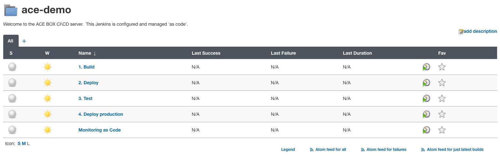

# ACE Demo use cases
This document outlines how to demo ACE use cases using the ACE-BOX.

## Demo overview
As part of this demo, we will use a set of multi-staged pipelines pre-deployed within Jenkins. We will demonstrate MaaS, Monaco and Quality Gates.

## ACE Demo pipelines
1. Navigate to your Jenkins instance. The link and credentials can be found on the ACE dashboard.
2. Within the Jenkins UI, you will see a couple of folders. Open up the `ace-demo` folder.
3. You will be presented with the following pipelines:
    

    The pipelines do the following:
    - `1. Build` builds the simplenodeservice app, creates a docker image and pushes that image to a local docker registry
    - `2. Deploy` deploys the built simplenodeservice image to the local kubernetes service in a staging namespace, as well as sends a Deployment event to Dynatrace
    - `3. Test` runs an automated jmeter tests and evaluates using Keptn Quality Gates or Dynatrace Cloud Automation. If the evaluation fails, the build will fail and the artifact will not be promoted to production
    - `4. Deploy Production` will deploy the promoted artifact to the production namespace
    - `Monitoring as Code` will use monaco to automatically configure the Dynatrace Environment
  
    The pipelines are daisy-chained. Meaning that only the `1. Build` pipeline needs to be run and will call subsequent pipelines as applicable.

## Source code
All the pipelines and source code are stored in the ace-box's Gitea server. The link and credentials can be found on the ACE dashboard. The repo is the same as this guide, namely `ace/ace`.

The following files/folders exist:
- `helm` folder: contains the helm chart for the simplenodeservice
- `jenkins` folder: contains the various Jenkinsfiles that contains the pipeline logic
- `jmeter` folder: contains the test files
- `cloudautomation` folder: contains the quality gate configuration like sli and slo definitions
- `mac` folder: contains the monaco configuration
- `app.js`: simplenodeservice application code
- `Dockerfile`: simplenodeservice Dockerfile definition for building the container image

## Starting the demo
Check out the detailed pages on what each pipeline does and how to demonstrate:
- [1. Build](1_Build.md) => Start here!
- [2. Deploy Staging](2_DeployStaging.md)
- [3. Test](3_Test.md)
- [4. Deploy Production](4_DeployProduction.md)
- [Monitoring As Code](MonitoringAsCode.md)